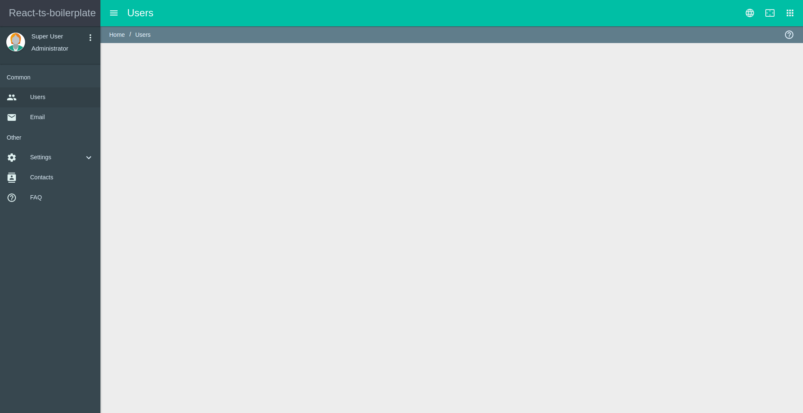

# React-typescript-boilerplate

# DEVELOPMENT

1. yarn
2. yarn run dev

# PRODUCTION

1. yarn
2. yarn run prod(HMR)  or  yarn run build(static)

# LINTING

* yarn run lint-js
* yarn run lint-css
* yarn run lint (yarn run lint-js and yarn run lint-css)

* yarn run lintfix-js
* yarn run lintfix-css
* yarn run lintfix (yarn run lintfix-js and yarn run lintfix-css)

# SCREENSHOT

# License

This project is licensed under the MIT license, Copyright (c) 2017 Cronix Micro Systems. For more information see LICENSE.md.